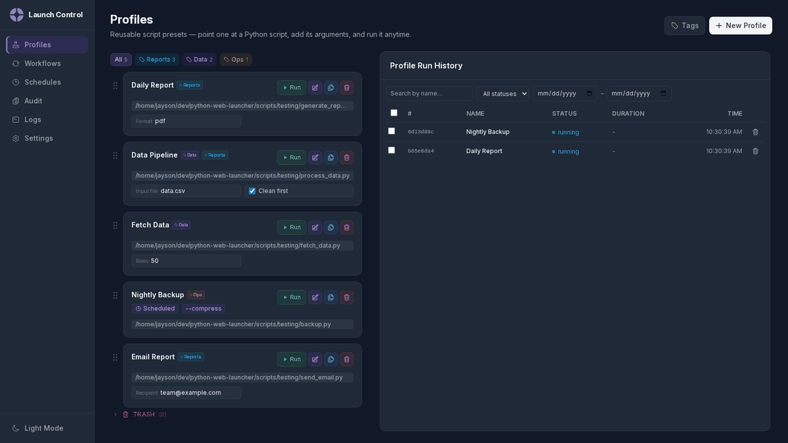

# Launch Control

Launch Control is a local, zero-dependency web tool for managing and running Python scripts through a browser UI. No `pip install`, no database, no build step -- just run it.



## Features

- **Profiles**: Reusable script presets with a name, script path, and arguments. Run with one click.
- **Workflows**: Chain profiles as sequential steps or parallel groups, with configurable error handling.
- **Tags**: Global labels shared by profiles and workflows, each with a pickable color used for chips and filter pills. Apply any number of tags, filter the lists by tag, and manage all tags from one place — deleting a tag simply removes it from the items that use it.
- **Schedules**: Run profiles or workflows automatically on cron-like schedules — every hour, daily at 09:00, weekdays at 08:30, or any 5-field cron expression.
- **Run History**: Full audit log of every run with output capture and status tracking. A run appears here as **Running** as soon as it starts — profile and workflow runs alike — and is updated in place when it finishes. Search and filter by name, status, and date range.
- **Audit**: Complete trail of every profile, workflow, and schedule change. Filter by action, entity type, name, and date range.
- **Server Logs**: Built-in log viewer with live tailing, level highlighting, and text search; the log file rotates automatically.
- **Custom Arguments**: Define typed input fields that appear on profile cards for quick parameter editing.
- **Script Timeout**: Per-profile time limit that kills runaway scripts and marks the run failed.
- **Stop Runs**: Kill a running script or workflow from the run panel; the run is recorded as cancelled with its output so far kept.
- **Output Export**: Download a run's output as a text file from the run panel.
- **Run Panel**: Run output opens in a panel docked to the right side of the screen, sliding in on open and sliding back out on close. Drag the grip pill on its left edge to resize it — the chosen width is remembered for next time. Clicking outside the panel closes it, but clicking another history row just swaps in that run's output.
- **Modern UI**: Dark/light theme, drag-to-reorder (editing or re-saving an item keeps its place in the list), responsive layout, terminal-style output viewer. If a run fails to start (for example the script was deleted after the page loaded), the card shows an inline error banner instead of failing silently.

## Quick Start

```bash
python3 launcher.py
```

Opens at `http://127.0.0.1:8765`. On Windows, the browser opens automatically.

## How Script Parameters Work

There are two ways to pass arguments to your scripts.

### Static Arguments

Set fixed arguments that are always sent to the script. In the profile editor, enter one argument per line in the **Arguments** field:

```
--input data.csv
--verbose
--format json
```

These are always appended to the command line when the profile runs. They are not editable at runtime.

### Custom Argument Fields

Define named fields that appear as editable inputs on the profile card. These let you change values at run time without editing the profile.

In the profile editor, click **+ Add Argument Field** to create one. Each field has:

| Field | Description |
|---|---|
| **Flag** | The CLI flag name, e.g. `--name`, `--rows` |
| **Label** | Display label on the card (defaults to the flag name) |
| **Type** | `Text` for string values, `Checkbox` for boolean flags |
| **Default** | Default value (text fields only) |

When you run the profile, the current values of these fields are passed to the script. For example, given this Python script:

```python
import argparse

parser = argparse.ArgumentParser()
parser.add_argument("--name", default="World", help="Name to greet")
parser.add_argument("--count", type=int, default=1, help="Number of greetings")
args = parser.parse_args()

for _ in range(args.count):
    print(f"Hello, {args.name}!")
```

You would create a profile with two custom argument fields:

| Flag | Type | Default |
|---|---|---|
| `--name` | Text | `World` |
| `--count` | Text | `1` |

The profile card then shows text inputs for each, pre-filled with the defaults. Change the values and hit Run.

### Checkbox Arguments

Checkbox fields act as boolean flags. When checked, the flag is included in the command line. When unchecked, it is omitted.

Given a script with a `--verbose` flag:

```python
parser.add_argument("--verbose", action="store_true")
```

Create a custom argument field with flag `--verbose` and type `Checkbox`. When the checkbox is checked on the card, the script receives `--verbose`. When unchecked, it does not.

### Static + Custom Together

You can use both static arguments and custom fields in the same profile. Static arguments are fixed. Custom fields are editable. At runtime, custom field values are placed first, followed by any static arguments:

```
<executable> <script> [--custom-field value ...] [static-arg ...]
```

### Arguments in Workflows

When a profile is added to a workflow, its current custom argument values are captured. You can override them per step in the workflow editor without changing the original profile. This lets the same profile run with different parameters in different workflow steps.

## Script Timeouts

Each profile can set a **Timeout (seconds)** in the profile editor — a plain number like `60` or a decimal like `2.5`. Whether the profile is run directly, as a workflow step, or on a schedule, Launch Control kills the script if it is still running after that long. The timed-out run is marked **failed**, and a `Timed out after Ns and was killed` line appears in its output. Leave the field blank to let scripts run indefinitely (the default).

The run panel's **Export** button downloads the run as a timestamped `.txt` file. For a workflow, the file combines the workflow progress log with every step's output, each under its own headed section; for a profile run it is the script's output (with the command that ran).

## Stopping a Run

While a profile or workflow is still running, the run panel shows a **Stop** button next to **Close**. Confirming it kills the running script right away — for a workflow, the current step is killed and the remaining steps are skipped. The run is recorded as **cancelled** (not failed) in Run History, with a `Cancelled by user.` line at the end of its output; output produced before the stop is kept and can still be exported. Cancelled is also an option in the history status filter.

## Scheduling Runs

The **Schedules** panel runs profiles or workflows automatically while Launch Control is running — for example "run this script every hour".

### Creating a Schedule

Click **New Schedule** (or **Edit** on an existing card) and pick:

1. **What should run** — a profile or a workflow (trashed items are not selectable).
2. **Label** (optional) — shown on the schedule card; defaults to the target's name.
3. **Schedule** — either a friendly preset or a custom cron expression, with a live preview of the next few run times.
4. **Enabled** — disabled schedules do nothing until re-enabled.

### Presets

Pick a preset kind and fill in the values — the compiled cron expression and the next few run times are previewed live as you type.

| Preset | Options | Compiles to | Example |
|---|---|---|---|
| **Repeat every...** | any number 1–59 | `*/N * * * *` | every 7 minutes |
| (unit: hours) | any number 1–23 | `0 */N * * *` | every 3 hours |
| (unit: days) | any number 1–31, at a time | `M H */N * *` | every 2 days at 06:30 |
| **Daily at a time** | any HH:MM | `M H * * *` | daily at 09:00 |
| **Weekly on days at a time** | any day combination | `M H * * D,D,...` | Mondays & Fridays at 08:00 |
| **Monthly on a day at a time** | day 1–31, any HH:MM | `M H D * *` | the 15th at 08:00 |

Repeat counts are free number inputs clamped to valid cron ranges (a "minute" repeat can't exceed 59, and so on). Monthly schedules skip months that lack the chosen day (e.g. Feb 30); day repeats count from the 1st of the month.

### Custom Cron

Advanced users can enter any 5-field cron expression:

```
minute hour day-of-month month day-of-week
```

- Fields accept `*`, lists (`1,5`), ranges (`9-17`), and steps (`*/15`, `8-18/2`, `10/5`).
- Day-of-week: `0` and `7` are Sunday, `1`–`6` are Monday–Saturday.
- Classic cron semantics: when both day-of-month and day-of-week are restricted, the schedule fires when **either** matches.

### Behaviour

- Times are **local wall-clock time**, minute granularity. On DST change days a scheduled wall-clock time may be skipped or run twice, like a real cron.
- **Missed runs are skipped**: if Launch Control is not running when a run is due, the next run happens at the next normal occurrence.
- **No overlap**: a schedule will not start a new run while its previous run is still active; the run starts on the next tick once the previous one finishes (ticks are every `SCHEDULER_TICK_SECONDS`).
- **Run now** fires a schedule immediately without changing its cadence; the firing is recorded in the **Audit** panel.
- Scheduled runs use the profile's stored argument values (as shown on the card) and appear in **Run History** with a "Scheduled" badge. Profile and workflow cards show a clock badge while an enabled schedule exists.
- Moving a profile or workflow to the trash pauses its schedule (the card shows "Target in trash"); restoring resumes it. **Permanently deleting** a target deletes its schedules.

## Searching History and Audit

Both **Run History** panels (Profile and Workflow) and the **Audit** panel have a filter bar above the table:

- **Name search**: case-insensitive substring match, applied as you type.
- **Status** (Run History only): Running, Completed, Failed, or Cancelled.
- **Action / Entity** (Audit only): filter on what happened and to what (including `Run now` firings and `Schedules`).
- **Date range**: From/To day pickers; both ends of the range are inclusive. Run History matches on the run's start time — the same time the **Time** column shows — so a long-running run is grouped under the day it started. Audit matches on when the change happened.

Filters combine (AND), reset the list to page 1, and clear with the **Clear** button. The list request carries them as query parameters: `name`, `status` (history), `action`/`entity` (audit), `since` and `until` (epoch seconds).

## Configuration

All config lives in `launcher/config.py`:

| Option | Default | Description |
|---|---|---|
| `PORT` | `8765` | Server listen port |
| `DATA_DIR` | `data/` | Where JSON data files are stored |
| `SCHEDULER_TICK_SECONDS` | `5` | How often the scheduler wakes up to check for due schedules |
| `LOG_MAX_BYTES` | `2000000` | Rotate `data/server.log` when it reaches this size (`0` disables rotation) |
| `LOG_BACKUP_COUNT` | `3` | How many datetime-stamped copies (e.g. `server.log.2026-09-08_11-19-10`) to keep |

The server mirrors its log output to `data/server.log` (rotated automatically at `LOG_MAX_BYTES`). The **Logs** panel in the UI tails this file with live updates, level highlighting, and text search, so it works on every platform regardless of how the server was launched — `python3 launcher.py`, the Makefile, or `start.bat` on Windows.

## Project Structure

```
launcher.py              # Entry point
index.html               # Main SPA shell

launcher/                # Python backend
  server.py              # HTTP server, routing, gzip
  config.py              # Port and file paths
  runner.py              # Script execution, workflow engine
  scheduler.py           # Cron engine and background scheduler
  storage.py             # JSON persistence, history
  compress.py            # Gzip compression with caching
  api/                   # API route handlers
    profiles.py          # Profile CRUD, reorder, duplicate
    workflows.py         # Workflow CRUD, reorder, duplicate
    runs.py              # Run execution and polling
    schedules.py         # Schedule CRUD, toggle, run-now, cron preview
    history.py           # History list, detail, delete
    filesystem.py        # Directory browsing, file dialog
    audit.py             # Audit trail list and detail
    logs.py              # Server log tailing for the Logs panel

static/                  # Frontend assets
  js/                    # Preact components
  vendor/                # Vendored Preact + Tailwind
  fonts/                 # Inter font

scripts/                 # Demo material for exercising the launcher
  testing/               # Example scripts (profiles, workflows, failure tests)
  dev/                   # Dev tooling (screencast demo generator)
tests/                   # pytest suite (dev-only; app stays stdlib-only)
  e2e/                   # Playwright end-to-end browser tests
data/                    # Runtime data (gitignored)
```

## Example Scripts

The `scripts/testing/` directory holds example scripts for exercising the launcher:

| Script | Purpose | Key Arguments |
|---|---|---|
| `test_script.py` | Basic greeting | `--name` |
| `generate_report.py` | Report generation | `--format`, `--output` |
| `process_data.py` | Data processing | `--input`, `--clean` |
| `fetch_data.py` | Data fetching | `--source`, `--rows` |
| `send_email.py` | Email simulation | `--to`, `--subject` |
| `backup.py` | File backup | `--dir`, `--compress` |
| `unstable_task.py` | Random failures | `--fail-rate` |

Dev tooling (not part of the example workload) lives in `scripts/dev/`.

## Running Tests

Tests use pytest (a dev-only dependency; the app itself needs nothing installed):

```bash
python3 -m pytest tests/
```

Run a single file or test:

```bash
python3 -m pytest tests/test_workflows.py
python3 -m pytest tests/test_workflow_execute.py -k parallel
```

### End-to-End Browser Tests

`tests/e2e/` contains Playwright tests that drive the real app — the stdlib server plus the browser UI — through actual page interactions (navigation, running profiles and workflows, modals, history, audit, logs, theme toggle).

They are part of the normal suite (`python3 -m pytest tests/`) and are skipped automatically when Playwright or Chromium is not installed. To run them:

```bash
pip install -r requirements-dev.txt
python3 -m playwright install chromium
python3 -m pytest tests/e2e/
```

Notes:

- Each run boots the server as a subprocess on a free port with a throwaway data directory, so e2e tests never touch your real `data/` store.
- Tests run headless; add `--headed` to watch them in a visible browser window.

### Demo Screencast

`scripts/dev/make_screencast.py` records a narrated-less video tour of the app with Playwright. It boots the real server on a free port with a throwaway data directory, seeds it with tagged profiles, a workflow, schedules, and run history (built from the example scripts), then drives the browser through every panel — running a profile with live output, filtering by tag, assigning an extra tag while editing, the tag manager, executing a workflow, the schedule editor's live cron preview, the audit trail, server logs, and the theme toggle — while recording the screen.

```bash
make demo                                    # writes demo/launcher_demo.webm
python3 scripts/dev/make_screencast.py --headed  # watch while it records
python3 scripts/dev/make_screencast.py --output demo/tour.webm --pause 1.5
python3 scripts/dev/make_screencast.py --gif demo/launcher_demo.gif   # also an animated GIF
```

Requires the same dev setup as the e2e tests (`pip install -r requirements-dev.txt` and `python3 -m playwright install chromium`). The `--gif` mode samples screenshots during the tour and assembles them with Pillow (also in `requirements-dev.txt`), resizing to `--gif-width` (default 800px); identical adjacent frames are merged so the pacing matches the recording. The output lands in `demo/` (gitignored); the throwaway data directory is removed afterwards.

## Requirements

Python 3.8+ with only the standard library — no packages needed to run the app. Unit tests additionally need pytest, and the e2e tests need pytest-playwright (`pip install -r requirements-dev.txt`).
